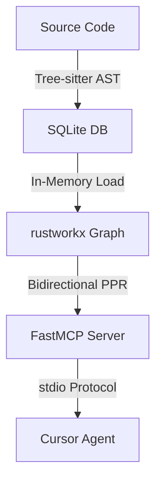

# GraphRAG-Code 🚀
**Python-native Code Knowledge Graph using bidirectional Personalized PageRank**

*A directed-graph PPR engine that ranks structurally related code and extracts exact source blocks (not just metadata). A single tunable weight selects between two query modes: downstream dependency context and upstream blast-radius.*

**Author:** [Bydecom](https://github.com/bydecom) · [graphrag-code](https://github.com/bydecom/graphrag-code)

## Why GraphRAG-Code? (The "Why")

In 2026, dumping entire raw files into LLM Agents is highly inefficient, leading to high token costs and increased hallucination rates.  
GraphRAG-Code solves this by combining **Abstract Syntax Tree (AST)** parsing with **Personalized PageRank run in both edge directions** (forward on the graph, backward on a reversed graph) on an optimized, in-memory graph. The two passes are merged with a tunable `backward_weight`.



## 📊 Benchmark (Small test codebase, 3 test cases — early/indicative only)

| Test Case               | Token Savings              | Latency           | Accuracy vs Full-file Baseline |
|-------------------------|----------------------------|-------------------|--------------------------------|
| Architecture Q&A (TC01) | ~89%                       | faster            | Equal or better                |
| Blast Radius (TC02)     | 97.3% (50,055 → 1,334 tok) | ↓54.6% (6.69→3.04s) | 0.43 vs 0.57 — needs tuning\* |

*\*These are early numbers on a single small codebase (3 test cases) and are **not** a rigorous evaluation. On Blast Radius, accuracy currently drops because aggressive pruning can cut loosely-coupled indirect dependencies; PPR seed resolution for private methods (beginning with `_`) is still being tuned. The full evaluation plan (≥10 repos, 3 baselines, structural metrics) lives in [`docs/RESEARCH.md`](docs/RESEARCH.md), which is the single source of truth for all numbers.*

### 🧪 RQ1 — Structural Retrieval (deterministic, no LLM)

A reproducible, LLM-free retrieval eval ([`eval_retrieval.py`](eval_retrieval.py)) compares three arms against a graph-derived ground truth (transitive closure). The durable, repo-independent finding is on **precision** for blast-radius queries: a forward-only PageRank spends most of its budget on irrelevant nodes, while Bidirectional PPR stays sharp — empirical evidence that the backward pass is a **necessary** component, not decoration.

| `blast_radius` · Precision@10 | `requests` | `click` |
|-------------------------------|-----------|---------|
| Unidirectional PPR (ablation) | 0.27 | 0.64 |
| **Bidirectional PPR (ours)** | **0.98** | **0.99** |
| Brute-force (1-hop) | 0.97 | 0.98 |

> Measured on the real `requests` and `click` packages (15 seeds each, post symbol-dedup). Bidirectional **matches** a naive 1-hop baseline on precision and **far exceeds** the single-direction ablation. We deliberately do **not** headline Recall@k: against a full transitive-closure ground truth it is dominated by closure size on large graphs (a hub with hundreds of transitive callers caps Recall@10 mechanically), so it measures hub size more than ranking quality. Reproduce: `python eval_retrieval.py --codebase-dir <pkg> --task blast_radius --k "3,5,10"`. Methodology + threats-to-validity: [`docs/RESEARCH.md` §4](docs/RESEARCH.md).

### 🔥 Core Differentiators:
- **Bidirectional PPR Merge (two query modes):** An engineering extension of the Repo Map concept. It runs Forward PPR (downstream dependencies) and Backward PPR (on the reversed graph) as two independent passes, then merges them with a tunable `backward_weight`. The default `0.2` leans toward downstream implementation context, while `get_impact` raises it to `0.9` to surface upstream callers (blast radius). It is therefore **two weight-selected modes**, not one symmetric "see everything" query.
- **Source Code Block Extraction:** Injects exact code blocks (snippets) into the LLM context using AST coordinates rather than just spitting out symbol metadata.
- **Interface Expansion (P0-2):** Traversing interface boundaries automatically via inheritance/dependency mapping (e.g., tracking consumers of implemented classes).
- **Orphan / Dead-Code Detection:** Because edges are derived purely from real `import`, `call`, and `contains` relationships, modules and classes that nothing references stay disconnected from the main graph. A class that floats alone is the graph honestly telling you it is never imported or instantiated anywhere — a free static smell-detector for dead or dynamically-invoked code.
- **Python-Native:** Highly optimized for the Python ecosystem (FastAPI, Django, Data Science).
- **Zero-Ops MCP Server:** Complies with the Model Context Protocol (MCP). Plugs directly into **Cursor** or **Claude Desktop** in seconds.

---

## 🛠 Quick Start

To run the pipeline natively using Python 3.10+:

```bash
# Install from source
pip install -e .

# Parse the codebase and generate the Knowledge Graph
graphrag-code-index --db graphrag_code.sqlite src

# Set your LLM API Key (Gemini recommended)
export GEMINI_API_KEY="your-api-key"

# Launch the interactive Terminal Agent
graphrag-code-agent
```

---

## 📊 Native IDE Integration
If you use **Cursor IDE** or **Claude Desktop**, GraphRAG-Code exposes standard Model Context Protocol (MCP) tools out-of-the-box.  
👉 See detailed instructions in [docs/CURSOR_CLAUDE_INTEGRATION.md](docs/CURSOR_CLAUDE_INTEGRATION.md).

### 🧰 MCP Tools

| Tool | When to use |
|------|-------------|
| **`plan_change`** *(v0.1.x)* | **Call before editing a symbol.** One-shot, token-light pre-edit briefing: overall risk + direct callers + ranked upstream blast radius + downstream deps. Metadata-only by default (`include_snippets=False`). |
| `get_impact` | Full blast-radius table (Bidirectional PPR, `backward_weight=0.9`) with per-row HIGH/MEDIUM/LOW confidence tiers. |
| `get_context` | 360° view of one symbol: direct callers + source code + downstream dependencies (with snippets). |
| `get_pruned_context` | Broad downstream context across related symbols, with token budgeting. |
| `get_callers` | Flat depth-1 list of upstream callers. |
| `list_symbols` | Structural overview of the codebase (or a single file). |

> Ambiguous names (e.g. a `validate` defined in two files) return a disambiguation prompt listing fully-qualified names instead of silently picking one — so blast-radius answers and benchmark seeds stay correct.

---

## 🏗 Architecture
The system utilizes `tree-sitter` to parse Python files into a graph of syntax nodes, stores it incrementally using SQLite, and loads it into a high-performance in-memory C-backed graph (`rustworkx`) to run PPR calculations in milliseconds.

---

## 🔍 Codebase Graph Visualization (Phase 2)

<p align="center">
  
</p>

> 💡 **Reading the graph:** Every symbol is attached to its file via `contains` edges, so each module forms a tight cluster of its classes and functions. If a whole cluster floats away from the rest (like an unused dialog), that is **intended** — it means nothing in the codebase statically imports or calls it. The graph surfaces orphan/dead code instead of hiding it behind fake links.

**Color Legend (Node Types):**
- 🟢 **Green (Ellipse):** `File / Module` (e.g., `main.py`)
- 🔵 **Blue (Box):** `Class` (e.g., `FullScreenApp`, `AppMenu`)
- ⚫ **Dark Grey (Box):** `Function / Method` (e.g., `__init__`, `create_widgets`)

**How to generate and view this interactive graph locally:**
```bash
# Export the indexed SQLite graph to a JSON format
graphrag-code-export --db graphrag_code.sqlite --out graph_data.json

# Open the visualizer in your browser and upload the JSON file
open examples/graph_visualizer.html
```

---

## Related Work

GraphRAG-Code targets **structural context for coding agents** (call/import graphs, blast radius, dependency snippets via MCP). It is **not** the [Microsoft GraphRAG](https://github.com/microsoft/graphrag) project, which indexes **unstructured text** with a different graph and query stack.

Work directly relevant to this problem:

| Reference | Relevance to GraphRAG-Code |
|-----------|----------------------------|
| [Aider Repo Map](https://aider.chat/docs/repomap.html) (Gauthier, 2024) | Tree-sitter + PageRank for repo context; we use **directed** graphs, **Personalized** PageRank from a seed symbol, and MCP-delivered **source blocks**. |
| [Codebase-Memory](https://arxiv.org/abs/2603.27277) (Vogel et al., 2026) | Tree-sitter knowledge graph + **MCP**; closest parallel. Aggregate quality 0.83 vs explorer 0.92, but graph wins hub/caller tasks on **19/31** langs. We add **Personalized** PPR and snippet extraction; they add **6-strategy call resolution**. |
| [Reliable Graph-RAG for Codebases](https://arxiv.org/abs/2601.08773) (Chinthareddy, 2026) | AST-derived DKB vs LLM-KB vs No-Graph on Java repos (Shopizer, ThingsBoard, OpenMRS). **95.6% aggregate** for DKB, but **ties** No-Graph on ThingsBoard; validates bidirectional + interface expansion. |
| *Practical Code RAG at Scale* (Galimzyanov et al., NeurIPS 2025) | Retrieval quality depends on **task type**; motivates separate tools (`get_impact` vs `get_context`) and a future hybrid intent router (graph vs lexical). |

Deeper positioning, debates, and metrics: [`docs/RESEARCH.md`](docs/RESEARCH.md) · [`docs/LITERATURE_REVIEW.md`](docs/LITERATURE_REVIEW.md).

---

## Acknowledgments

Developed primarily in [Cursor](https://cursor.com). Architecture, evaluation design (`eval_retrieval.py`), and shipped code are the author's responsibility.

---

## ⚠️ Known Limitations
- Currently, GraphRAG-Code natively supports Python codebases (multi-language support is planned for future releases).
- **Latency overhead of ~20-25% on tiny codebases** (<20 files) due to MCP initialization and in-memory graph loading. This is compensated by massive performance gains and token savings on larger codebases.
- Heuristics for private methods (beginning with `_`) are undergoing active refinement.
- Dynamic import, decorator, and metaclass analysis are not fully resolved at the AST syntax level without static type resolution.
