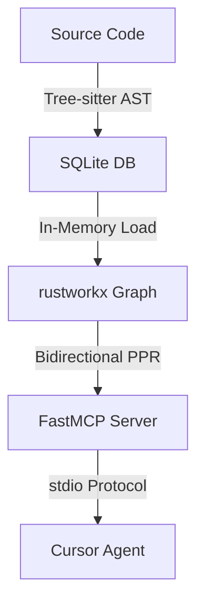
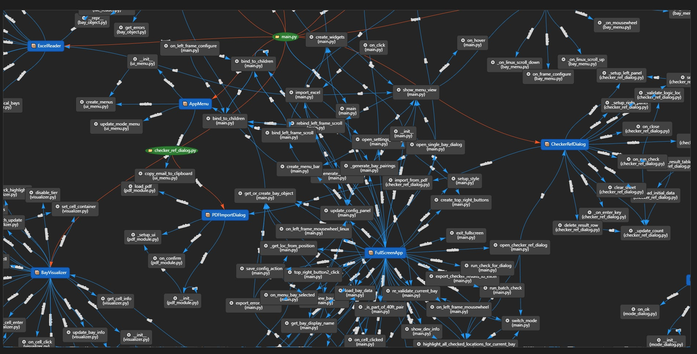

# GraphRAG-Code 🚀
**Python-native Code Knowledge Graph using Bidirectional PPR**

*An efficient approach to retrieve both upstream callers and downstream dependencies within a single query, extracting exact source code blocks rather than just metadata.*

## Why GraphRAG-Code? (The "Why")

In 2026, dumping entire raw files into LLM Agents is highly inefficient, leading to high token costs and increased hallucination rates.  
GraphRAG-Code solves this by combining **Abstract Syntax Tree (AST)** parsing with a **Bidirectional Personalized PageRank (B-PPR)** algorithm running on an optimized, in-memory graph.



## 📊 Benchmark (Small test codebase, 3 test cases)

| Query Type        | Token Savings | Accuracy vs Baseline |
|-------------------|---------------|----------------------|
| Architecture Q&A  | ~89%          | Equal or better      |
| Blast Radius      | ~97%          | Needs improvement*   |

*\*PPR seed resolution is currently being tuned for internal methods (private functions beginning with `_`). While overhead latency may increase by ~20% on very small codebases, B-PPR shines on large-scale codebases.*

### 🔥 Core Differentiators:
- **Bidirectional PPR Merge:** An academic extension of the Repo Map concept. It merges Forward PPR (downstream dependencies) and Backward PPR (on the Reversed Graph) with a `backward_weight=0.7` to evaluate both blast radius and implementation context in a single query.
- **Source Code Block Extraction:** Injects exact code blocks (snippets) into the LLM context using AST coordinates rather than just spitting out symbol metadata.
- **Interface Expansion (P0-2):** Traversing interface boundaries automatically via inheritance/dependency mapping (e.g., tracking consumers of implemented classes).
- **Python-Native:** Highly optimized for the Python ecosystem (FastAPI, Django, Data Science).
- **Zero-Ops MCP Server:** Complies with the Model Context Protocol (MCP). Plugs directly into **Cursor** or **Claude Desktop** in seconds.

---

## 🛠 Quick Start

To run the pipeline natively using Python 3.10+:

```bash
# Install from source
pip install -e .

# Parse the codebase and generate the Knowledge Graph
graphrag-code-index --db graphrag_code.sqlite src

# Set your LLM API Key (Gemini recommended)
export GEMINI_API_KEY="your-api-key"

# Launch the interactive Terminal Agent
graphrag-code-agent
```

---

## 📊 Native IDE Integration
If you use **Cursor IDE** or **Claude Desktop**, GraphRAG-Code exposes standard Model Context Protocol (MCP) tools out-of-the-box.  
👉 See detailed instructions in [docs/CURSOR_CLAUDE_INTEGRATION.md](docs/CURSOR_CLAUDE_INTEGRATION.md).

---

## 🏗 Architecture
The system utilizes `tree-sitter` to parse Python files into a graph of syntax nodes, stores it incrementally using SQLite, and loads it into a high-performance in-memory C-backed graph (`rustworkx`) to run PPR calculations in milliseconds.

---

## 🔍 Codebase Graph Visualization (Phase 2)

<p align="center">
  
</p>

**Color Legend (Node Types):**
- 🟢 **Green (Ellipse):** `File / Module` (e.g., `main.py`)
- 🔵 **Blue (Box):** `Class` (e.g., `FullScreenApp`, `AppMenu`)
- ⚫ **Dark Grey (Box):** `Function / Method` (e.g., `__init__`, `create_widgets`)

**How to generate and view this interactive graph locally:**
```bash
# Export the indexed SQLite graph to a JSON format
graphrag-code-export --db graphrag_code.sqlite --out graph_data.json

# Open the visualizer in your browser and upload the JSON file
open examples/graph_visualizer.html
```

---

## ⚠️ Known Limitations
- Currently, GraphRAG-Code natively supports Python codebases (multi-language support is planned for future releases).
- **Latency overhead of ~20-25% on tiny codebases** (<20 files) due to MCP initialization and in-memory graph loading. This is compensated by massive performance gains and token savings on larger codebases.
- Heuristics for private methods (beginning with `_`) are undergoing active refinement.
- Dynamic import, decorator, and metaclass analysis are not fully resolved at the AST syntax level without static type resolution.
