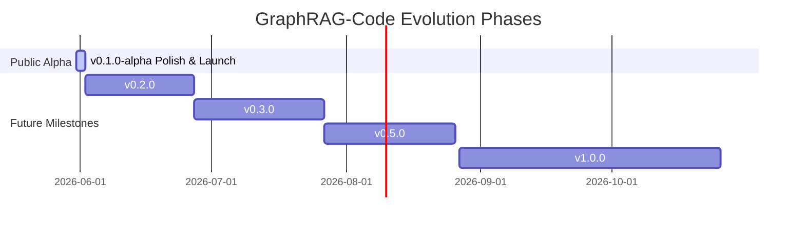

# GraphRAG-Code Public Roadmap

This document outlines the high-level roadmap for the GraphRAG-Code open-source ecosystem. We welcome community feedback, feature requests, and academic collaboration.

---

## 🗺️ High-Level Gantt Schedule

---

## 🚀 Execution Phases

### Phase 1: GitHub Alpha Release (v0.1.0-alpha) — **[COMPLETED]**
*   **Deliverables:**
    1.  **Repository Cleanup:** Establish clean `.gitignore`, remove raw dev caches, and streamline standard dependencies.
    2.  **Path & API Hardening:** Fix tree-sitter v0.23+ compatibility via `QueryCursor` and deploy **Dynamic Path Resolution** for stdio MCP sub-shells.
    3.  **Stdio Isolation:** Migrate all stdout `print()` logs inside the MCP Server and Core Engine to standard `logging` piped directly to `sys.stderr` to prevent JSON-RPC stream contamination.
    4.  **Academic Positioning:** Publish `docs/RESEARCH.md` detailing how Bidirectional Personalized PageRank merges both blast radius and implementation context within 90%+ token savings.

### Phase 2: Usable Multi-Language OSS (v0.2.0) — *Est: June 2026*
*   **Target Deliverables:**
    1.  **Multi-Language AST Support:** Add tree-sitter static parsing configurations for TypeScript/JavaScript and Java.
    2.  **Real-time Active Tab Seeds:** Utilize the MCP protocol to automatically fetch active open files/tabs from modern IDEs (like Cursor) and use them as dynamic seed nodes to boost PPR scores on-the-fly without manual user input.
    3.  **LSIF-Assisted Semantic Resolution:** Bridge AST's semantic blind spots at interface boundaries (especially in OOP languages like Java/TypeScript) by integrating lightweight Language Server Index Format (LSIF) dumping for robust type-resolution, merging it with AST's speed.
    4.  **Community Evaluation:** Benchmark GraphRAG-Code metrics on $\ge$ 5 real-world open-source repositories.

### Phase 3: Academic Ablation & Research Positioning (v0.3.0) — *Est: July 2026*
*   **Target Deliverables:**
    1.  **Intent-based Dynamic Weighting & Ablation:** Transition from a static `backward_weight=0.7` to dynamic NLP-driven weighting. Prompts containing "blast radius/affect" will spike backward weights to 0.9, while "how it works/flow" will favor forward downstream traversal. This will be rigorously evaluated via an ablation study.
    2.  **Systematic Error Log:** Candidly document edge cases (e.g., dynamic imports, decorators) where structural indexing fails.
    3.  **Academic Preprint Draft:** Complete a 6–8 page research manuscript highlighting local-first ast-derived graph advantages over LLM-generated indexing.

### Phase 4: Production Packaging (v0.5.0) — *Est: August 2026*
*   **Target Deliverables:**
    1.  **PyPI Release:** Package modular `graphrag-code-core` structure and publish to public repositories.
    2.  **Incremental Watch Mode:** Setup persistent file-system watching (`watchdog`) to update graph caches instantly.
    3.  **Module Clustering:** Run Louvain or Leiden community detection to bundle large code graphs into human-navigable module groups.

### Phase 5: Enterprise Scaling & Hybrid RAG (v1.0.0) — *Est: Q4 2026 (Stretch Goal)*
*   **Target Deliverables:**
    1.  **Intent Router:** Set up a lightweight router that maps pure PL$\rightarrow$PL code completion tasks directly to BM25, and structural/architectural queries to B-PPR.
    2.  **Centralized Multi-Repo Sync:** Sync sqlite graphs to a centralized PostgreSQL registry to support cross-service microservice blast-radius evaluations.
